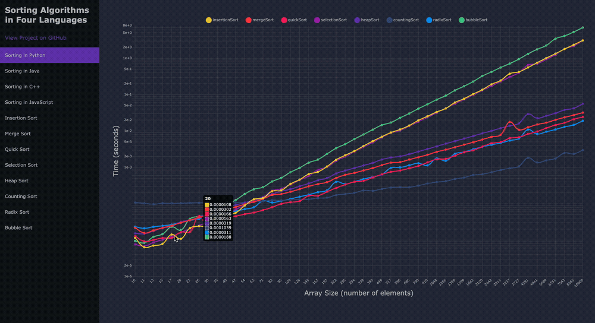
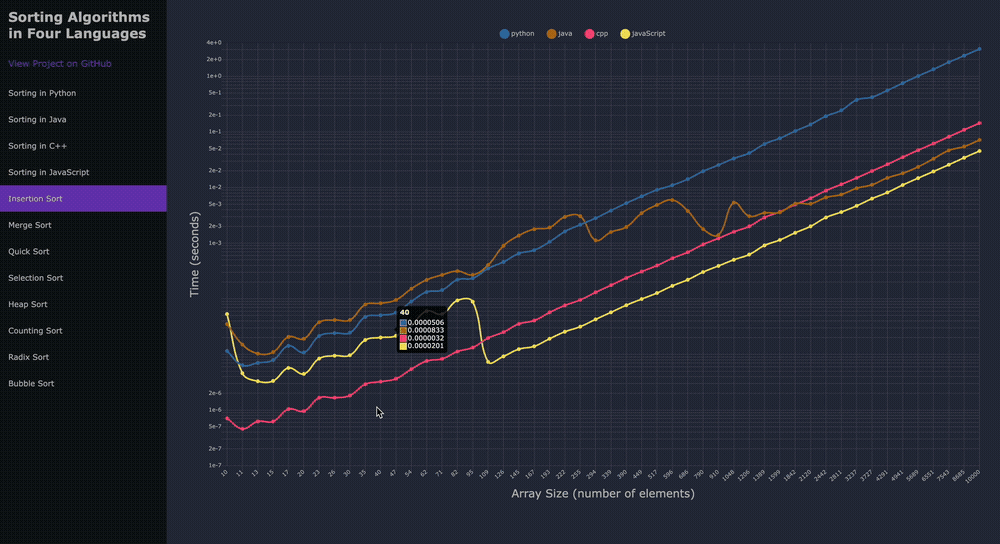

# Sorting Algorithms in Four Languages
Comparing the efficiencies of sorting algorithms implemented 
in four programming languages: Python, Java, C++, and JavaScript.

Results: https://jonperk318.github.io/sorting-algorithms/

## How to Use
Languages and packages used:
* Python 3.12.2
* Java 21.0.1
* C++ Apple Clang 15.0.0 (clang-1500.3.9.4)
* JavaScript Node 20.15.0
* * npm 10.7.0
* * webpack-cli 5.1.4

First, run `./samples/sample_generator.py` to generate 50 sample arrays of logarithmically-spaced sizes from
10 to 10,000, each containing randomly-generated integers ranging from 1 to 1,000. These arrays are outputted into text 
files along with `./samples/sample-sizes.txt`, which contains the array sizes.

Second, run the following four main functions each utilizing eight sorting algorithms implemented in their respective 
languages:
* `./python-algorithms/main.py`
* `./java-algorithms/src/Main.java`
* `./cpp-algorithms/main.cpp`
* `./javascript-algorithms/main.js`

These each generate text files containing the sorting times for each algorithm.

Third, run `./src/result-loader.js` to convert these results into `./dist/results.js`, using a format readable by 
`./dist/main.js`. To generate this file, run `npx webpack` in the root directory.

## Results

The first four sections show all sorting algorithms in one of four languages. The y-axis 
of each graph is scaled logarithmically.

In all four languages, for the largest arrays, bubble sort was the slowest and counting sort was the fastest. 
For the smallest arrays, insertion sort was the fastest and either merge sort or counting sort were the slowest.

Python was often the slowest language on average for all except counting sort and radix sort, which on average 
had slower times in Java.

JavaScript had the fastest times for larger arrays on all algorithms except for merge sort, 
and Java came in second on several others.

## Sources

This project was inspired by:
* The sorting algorithms demonstrated in multiple languages on GeeksforGeeks:
  https://www.geeksforgeeks.org/sorting-algorithms/
* A sorting benchmark project by Ilya Frolov:
  https://github.com/frolovilya/sorting-benchmark/